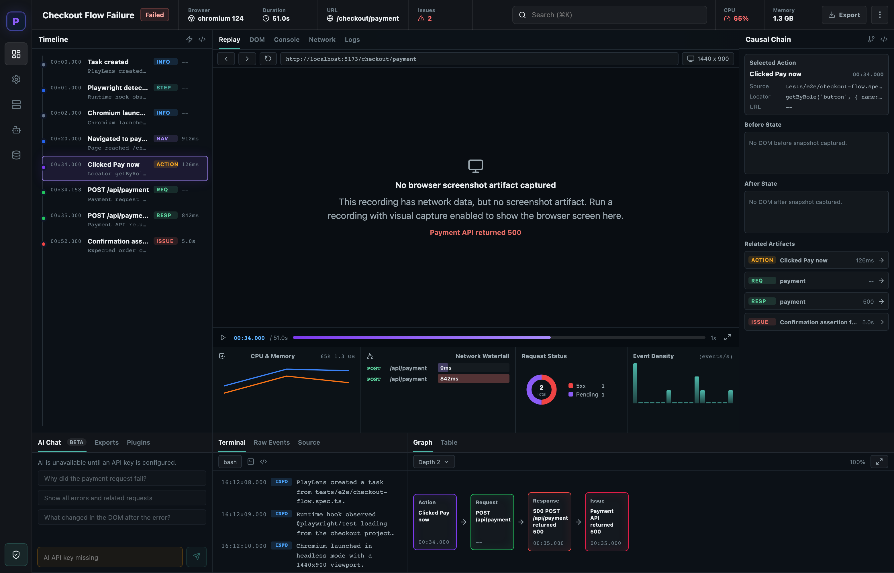
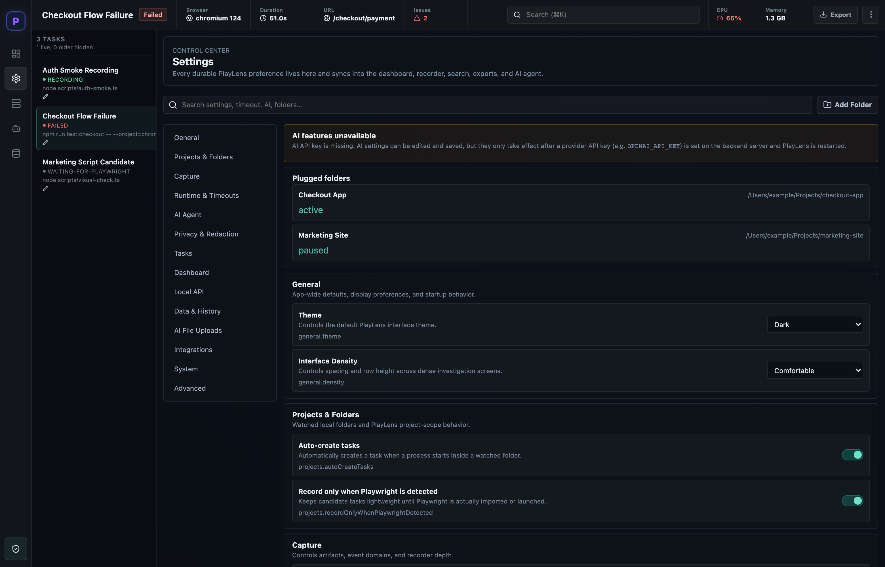
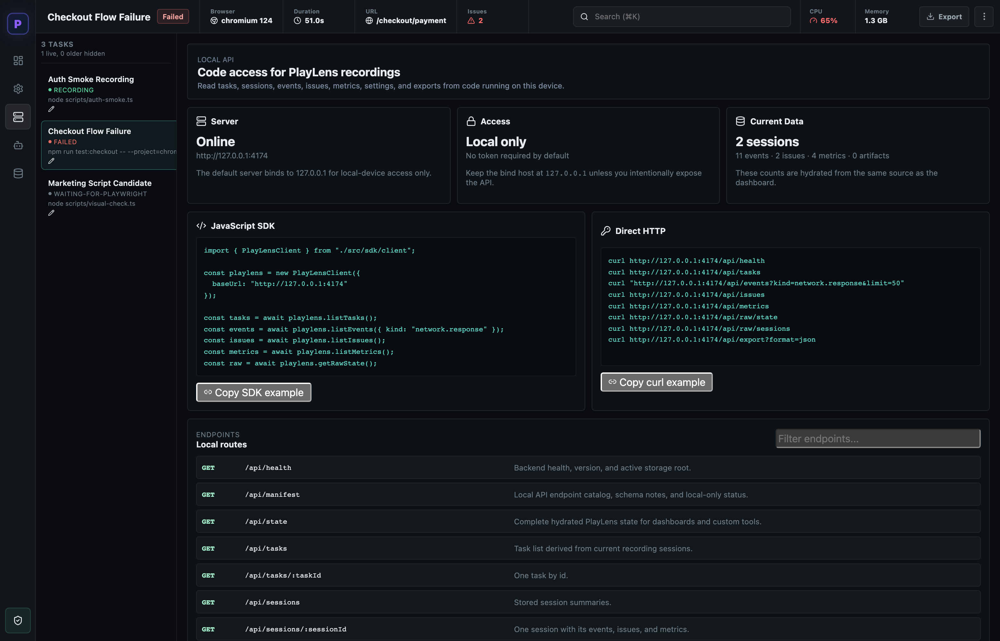
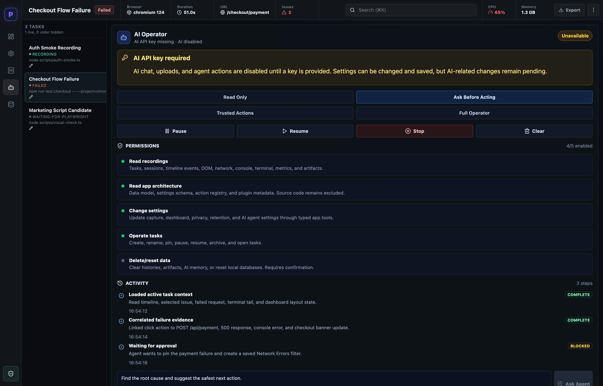
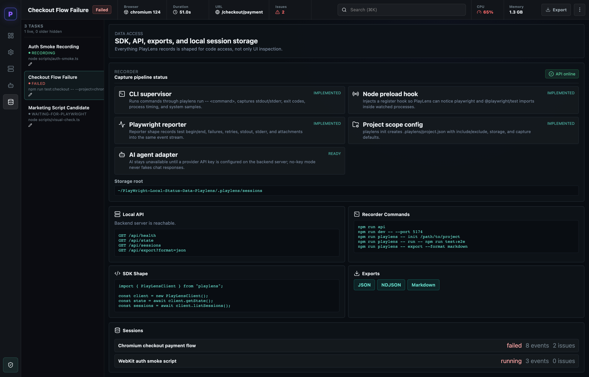

# PlayLens

> Local-first observability dashboard for Playwright sessions — browser events, terminal output, network-style evidence, and AI-ready debugging context, all in one place.


**TypeScript dashboard • Playwright evidence • local debugging**

---

## ⚡ TL;DR — what you need to know

| | |
| --- | --- |
| **What it is** | A local dashboard that captures what happened during a Playwright run — timeline, browser events, terminal output, metrics, issues — so you don't dig through scattered logs. |
| **Run it** | `npm install` → `npm run api` (port 4174) → `npm run dev` (port 5173) → open http://127.0.0.1:5173. |
| **Empty by default** | The dashboard starts blank until you connect a real run. Set `PLAYLENS_DEMO_MODE=1` on the API to explore with sample data. |
| **Connect a run** | `playlens init .` in your Playwright project, then `playlens run -- npm run test:e2e`. |
| **Local-only** | Backend binds to `127.0.0.1`; nothing leaves your device unless you expose it. Storage is file-based in `.playlens/`. |
| **AI is optional** | The AI Agent panel needs a `MINIMAX_API_KEY`. Without it, everything else works normally. |
| **Read from code** | A local HTTP API + TypeScript SDK expose tasks, sessions, events, issues, metrics, settings, and exports. |
| **Export** | JSON, NDJSON, and Markdown — ready to paste into an AI agent for follow-up investigation. |
| **Requires** | Node.js **22+**. |

**Who it's for:** developers running Playwright locally who want to *see* a failed run — its timeline, the browser/runtime events, terminal output, and a causal chain — instead of scrolling raw console logs, and who want to hand that evidence to an AI agent.

**Jump to:** [Screenshots](#screenshots) · [Quick Start](#quick-start) · [Architecture](#architecture) · [Features](#features) · [Connect a real folder](#connect-a-real-playwright-folder) · [Local API](#use-the-local-api-from-code) · [AI features](#ai-features-optional) · [Demo](#try-the-included-demo) · [CLI](#cli-usage) · [Verification](#verification) · [Tech stack](#tech-stack) · [Project structure](#project-structure) · [Docs](#documentation)

---

## Why use PlayLens?

- Keeps Playwright run evidence in a **local dashboard**.
- Captures **browser events, task state, terminal output, and debugging context**.
- Exports **AI-agent-ready context** for follow-up investigation.
- Works as an **inspection layer** around local automation sessions.

### Current limitations

- Focused on **Playwright** workflows, not every test runner.
- Local setup is required before it can collect useful run data.
- Network-style evidence is observability context, not a replacement for full packet capture.

---

## Screenshots

> Captured from the dashboard running in `PLAYLENS_DEMO_MODE=1` with sample sessions. Paths shown are illustrative.

### Investigation Dashboard — Timeline, Evidence, Causal Chain & Terminal

*Left: the run **Timeline** (task created → Playwright detected → browser launched → navigation → click → failing POST). Center: Replay/DOM/Console/Network/Logs tabs, CPU & Memory, Network Waterfall, Response Status, and Event Density. Bottom: AI Chat, **Terminal output**, and a Graph/Table causal view. Right: the **Causal Chain** with before/after state and related artifacts.*

### Settings Control Center — 14 Setting Groups

*General, Projects & Folders, Capture, Runtime & Timeouts, AI Agent, Privacy & Redaction, Tasks, Dashboard, Local API, Data & History, AI File Uploads, Integrations, System, and Advanced — with plugged-folder management, theme, and interface density.*

### Local API — SDK & Direct HTTP Access

*Server status, access scope, current data counts, a copyable JavaScript SDK snippet, ready-to-run `curl` examples, and the full local route list.*

### AI Agent Panel — Operator with Permission Modes & Tools

*A MiniMax-powered operator with permission modes (Read Only, Ask Before Acting, Trusted Actions, Full Operator), granular tool permissions, and a live action/approval activity log. Disabled until an API key is provided.*

### Data Access — Sessions, Exports & Recorder Status

*Capture pipeline status (CLI supervisor, node preload hook, Playwright reporter, project scope config, AI adapter), storage root, local API health, recorder commands, SDK shape, export links, and the session list.*

---

## Architecture


*Playwright runs feed through a recorder and supervisor into the local dashboard for inspection and AI-powered analysis.*

---

## Features

- **Investigation Dashboard** — Timeline, real captured evidence panes, metric charts, issue focus, network waterfall, graph/table causal views, and terminal output.
- **Task Management** — Track multiple Playwright tasks with status, entry files, and session associations.
- **Settings Control Center** — 14 settings groups covering general, capture, runtime, local API, AI, privacy, integrations, and more.
- **Local API** — Free local-only HTTP API and SDK methods for reading tasks, sessions, events, issues, metrics, settings, and exports from code.
- **AI Agent Panel** — MiniMax-powered operator with 4 permission modes and 8 tools (optional, disabled without API key).
- **Data Access** — API health, session browser, and export links (JSON, NDJSON, Markdown).
- **Global Search** — Search across tasks, settings, issues, events, and AI history.
- **CLI** — Initialize projects, run commands under supervision, export data, and check system health.
- **Recorder System** — Runtime hook detects Playwright imports; a process supervisor captures child-process output.
- **SDK Client** — Programmatic access to PlayLens data for custom integrations.
- **Local Storage** — File-based session storage in `.playlens/` with no external dependencies.

---

## Quick Start

```bash
# Install dependencies
npm install

# Start the backend API server (port 4174)
npm run api

# Start the dashboard (in another terminal)
npm run dev

# Open http://127.0.0.1:5173
```

By default the dashboard starts **empty** — it does not show demo recordings unless `PLAYLENS_DEMO_MODE=1` is set on the API server. To explore with sample data:

```bash
PLAYLENS_DEMO_MODE=1 npm run api
```

---

## Connect A Real Playwright Folder

Initialize the folder once:

```bash
cd /path/to/your/playwright-project
"/path/to/PlayLens Browser Dashboard Program/node_modules/.bin/tsx" \
"/path/to/PlayLens Browser Dashboard Program/src/cli/playlens.ts" init .
```

Run Playwright through PlayLens:

```bash
cd /path/to/your/playwright-project
"/path/to/PlayLens Browser Dashboard Program/node_modules/.bin/tsx" \
"/path/to/PlayLens Browser Dashboard Program/src/cli/playlens.ts" run -- npm run test:e2e
```

Start the dashboard against that folder's real sessions:

```bash
cd "/path/to/PlayLens Browser Dashboard Program"
PLAYLENS_STORAGE_DIR="/path/to/your/playwright-project/.playlens/sessions" npm run api
```

In another terminal:

```bash
cd "/path/to/PlayLens Browser Dashboard Program"
npm run dev -- --port 5173
```

Open `http://127.0.0.1:5173/`. If the sessions folder is empty, the dashboard stays blank with a "No active recording" message.

---

## Use The Local API From Code

The backend binds to `127.0.0.1` by default, so the API is local to this device unless you intentionally expose it.

```ts
import { PlayLensClient } from "./src/sdk/client";

const playlens = new PlayLensClient({ baseUrl: "http://127.0.0.1:4174" });

const tasks = await playlens.listTasks();
const events = await playlens.listEvents({ kind: "network.response" });
const issues = await playlens.listIssues();
const metrics = await playlens.listMetrics();
const raw = await playlens.getRawState();
```

### Routes

```text
GET  /api/manifest
GET  /api/tasks
GET  /api/sessions/:sessionId
GET  /api/sessions/:sessionId/events
GET  /api/events?taskId=<id>&kind=network.response
GET  /api/issues
GET  /api/metrics
GET  /api/settings
POST /api/settings
GET  /api/project-scopes
GET  /api/audit
GET  /api/ai/messages
GET  /api/uploads
GET  /api/export?format=json|ndjson|markdown
GET  /api/raw/state
GET  /api/raw/sessions
GET  /api/raw/sessions/:sessionId/manifest
GET  /api/raw/sessions/:sessionId/events
```

---

## AI Features (Optional)

AI features require a MiniMax API key. Without it, PlayLens works normally.

```bash
cp .env.example .env
# Edit .env and add: MINIMAX_API_KEY=your_key_here
```

The AI Agent panel offers four **permission modes** — Read Only, Ask Before Acting, Trusted Actions, and Full Operator — with granular tool permissions (read recordings, read app architecture, change settings, operate tasks, delete/reset data). See `ENV.md` for detailed environment variable documentation.

---

## Try The Included Demo

```bash
cd demo-projects/payment-checkout-playwright-demo
npm install
cd ../..
npm run playlens -- init demo-projects/payment-checkout-playwright-demo
cd demo-projects/payment-checkout-playwright-demo
../../node_modules/.bin/tsx ../../src/cli/playlens.ts run -- npm run demo:fail
```

Export captured data:

```bash
../../node_modules/.bin/tsx ../../src/cli/playlens.ts export --format markdown
../../node_modules/.bin/tsx ../../src/cli/playlens.ts export --format json
../../node_modules/.bin/tsx ../../src/cli/playlens.ts export --format ndjson
```

---

## CLI Usage

```bash
npm run playlens -- init <folder>    # Initialize a project folder
npm run playlens -- run -- <command> # Run a command under PlayLens supervision
npm run playlens -- server           # Start the API server
npm run playlens -- export           # Export session data
npm run playlens -- doctor           # System health check
npm run playlens -- help             # Show help
```

---

## Verification

```bash
npm run lint         # TypeScript type-check
npm run test         # All unit tests (logic, agent, minimax, recorder)
npm run test:smoke   # Full smoke test
npm run build        # Production build
```

---

## Tech Stack

| Technology | Version | Purpose |
|-----------|---------|---------|
| React | 19 | UI framework |
| Vite | 6 | Build tool and dev server |
| TypeScript | 5.6 | Type safety |
| Node.js | 22+ | Backend runtime |
| Lucide React | 0.468 | Icon library |
| Multi-provider AI | gpt-5.5-pro, claude-opus-4-7, minimax-m3, and more | AI features (optional) |

---

## Project Structure

```
src/
  agent/        — AI agent runtime, tools, MiniMax adapter, file ingestion
  cli/          — CLI commands (init, run, server, export, doctor)
  components/   — React UI components (Investigation Dashboard, Settings,
                  Local API, AI Agent, Data Access, Task Rail, Global Search,
                  Recorder Status)
  data/         — Type definitions and mock data
  exporters/    — JSON, NDJSON, Markdown export formatters
  recorder/     — Process supervisor, Playwright reporter, runtime hook
  sdk/          — Client SDK for consuming PlayLens data
  server/       — Node HTTP backend API (port 4174)
  state/        — Central state management
  storage/      — File-based session storage
  styles/       — Dark theme CSS
  tests/        — Unit tests (4 suites)
scripts/        — Full smoke test runner
playlens-runtime/ — Node.js runtime hooks (CJS register.cjs + ESM esm-hooks.mjs)
demo-projects/  — Example Playwright project
```

---

## Documentation

- [SETUP.md](SETUP.md) — Detailed installation and setup instructions
- [ENV.md](ENV.md) — Environment variable reference
- [DESKTOP-APP.md](DESKTOP-APP.md) — Desktop (Electron) app notes
- [TROUBLESHOOTING.md](TROUBLESHOOTING.md) — Common issues and solutions
- [CONTRIBUTING.md](CONTRIBUTING.md) — How to contribute
- [CHANGELOG.md](CHANGELOG.md) — Version history
- [SECURITY.md](SECURITY.md) — Security policy
- [docs/project-snapshot.md](docs/project-snapshot.md) — Generated file-mix chart and repo checklist
- [LICENSE](LICENSE) — MIT License

---

## License

MIT — see [LICENSE](LICENSE) for details.

---

## Real Visual Snapshot

These visuals are generated from the actual repository structure and project workflow, not placeholders.


