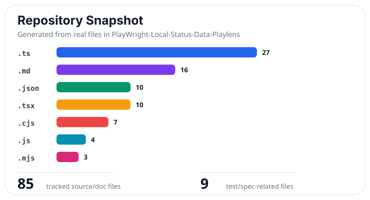
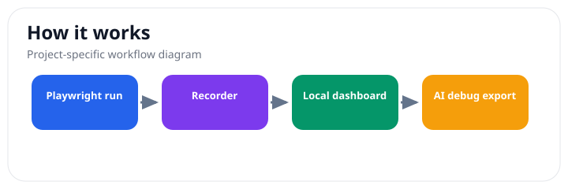
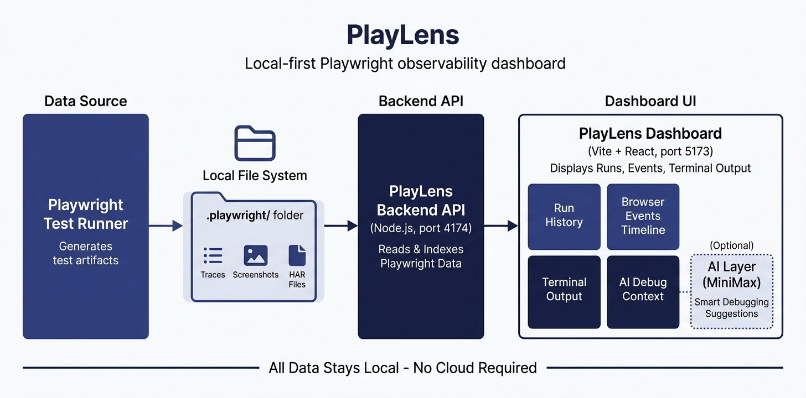

# PlayLens

> Local-first observability dashboard for Playwright sessions, browser events, terminal output, and AI-ready debugging context.

 

**TypeScript dashboard • Playwright evidence • local debugging**

## At a Glance

- Real project documentation now includes security guidance, contribution notes, issue/PR templates, and real visual snapshots.
- Maintenance snapshot: see [docs/project-snapshot.md](docs/project-snapshot.md) for a generated file-mix chart and repository checklist.
- Public repo: https://github.com/Evan1108-Coder/PlayWright-Local-Status-Data-Playlens

---


## Real Visual Snapshot

These visuals are generated from the actual repository structure and project workflow, not placeholders.





> Status: beta. PlayLens is designed for local debugging and inspection of Playwright runs; integrations may need adjustment for different test setups.

PlayLens helps developers see what happened during browser automation without digging through scattered terminal logs, screenshots, traces, and agent notes.

## Why Use PlayLens?

- Keeps Playwright run evidence in a local dashboard.
- Captures browser events, task state, terminal output, and debugging context.
- Exports AI-agent-ready context for follow-up investigation.
- Works as an inspection layer around local automation sessions.

## Current Limitations

- It is focused on Playwright workflows, not every test runner.
- Local setup is required before it can collect useful run data.
- Network-style evidence is observability context, not a replacement for full packet capture.


PlayLens is a local-first observability dashboard for Playwright runs. It captures tasks, browser/runtime events, terminal output, network-style evidence, settings, exports, and AI-agent-ready context so developers can inspect and share automation sessions.

## Architecture



*Playwright runs feed through a recorder and supervisor into the local dashboard for inspection and AI-powered analysis.*

## Features

- **Investigation Dashboard** — Timeline, real captured evidence panes, metric charts, issue focus, network waterfall, graph/table causal views, and terminal output
- **Task Management** — Track multiple Playwright tasks with status, entry files, and session associations
- **Settings Control Center** — 14 settings groups covering general, capture, runtime, local API, AI, privacy, integrations, and more
- **Local API** — Free local-only HTTP API and SDK methods for reading tasks, sessions, events, issues, metrics, settings, and exports from code
- **AI Agent Panel** — MiniMax-powered operator with 4 permission modes and 8 tools (optional, disabled without API key)
- **Data Access** — API health, session browser, and export links (JSON, NDJSON, Markdown)
- **Global Search** — Search across tasks, settings, issues, events, and AI history
- **CLI** — Initialize projects, run commands under supervision, export data, and check system health
- **Recorder System** — Runtime hook detects Playwright imports, process supervisor captures child process output
- **SDK Client** — Programmatic access to PlayLens data for custom integrations
- **Local Storage** — File-based session storage in `.playlens/` with no external dependencies

## Quick Start

```bash
# Install dependencies
npm install

# Start the backend API server (port 4174)
npm run api

# Start the dashboard (in another terminal)
npm run dev

# Open http://127.0.0.1:5173
```

By default the dashboard starts empty. It does not show demo recordings unless `PLAYLENS_DEMO_MODE=1` is set.

## Connect A Real Playwright Folder

Initialize the folder once:

```bash
cd /path/to/your/playwright-project
"/path/to/PlayLens Browser Dashboard Program/node_modules/.bin/tsx" \
"/path/to/PlayLens Browser Dashboard Program/src/cli/playlens.ts" init .
```

Run Playwright through PlayLens:

```bash
cd /path/to/your/playwright-project
"/path/to/PlayLens Browser Dashboard Program/node_modules/.bin/tsx" \
"/path/to/PlayLens Browser Dashboard Program/src/cli/playlens.ts" run -- npm run test:e2e
```

Start the dashboard against that folder's real sessions:

```bash
cd "/path/to/PlayLens Browser Dashboard Program"
PLAYLENS_STORAGE_DIR="/path/to/your/playwright-project/.playlens/sessions" npm run api
```

In another terminal:

```bash
cd "/path/to/PlayLens Browser Dashboard Program"
npm run dev -- --port 5173
```

Open `http://127.0.0.1:5173/`. If the sessions folder is empty, the dashboard stays blank with a "No active recording" message.

## Use The Local API From Code

The backend binds to `127.0.0.1` by default, so the API is local to this device unless you intentionally expose it.

```ts
import { PlayLensClient } from "./src/sdk/client";

const playlens = new PlayLensClient({
  baseUrl: "http://127.0.0.1:4174"
});

const tasks = await playlens.listTasks();
const events = await playlens.listEvents({ kind: "network.response" });
const issues = await playlens.listIssues();
const metrics = await playlens.listMetrics();
const raw = await playlens.getRawState();
```

Useful routes:

```text
GET /api/manifest
GET /api/tasks
GET /api/sessions/:sessionId
GET /api/sessions/:sessionId/events
GET /api/events?taskId=<id>&kind=network.response
GET /api/issues
GET /api/metrics
GET /api/settings
POST /api/settings
GET /api/project-scopes
GET /api/audit
GET /api/ai/messages
GET /api/uploads
GET /api/export?format=json|ndjson|markdown
GET /api/raw/state
GET /api/raw/sessions
GET /api/raw/sessions/:sessionId/manifest
GET /api/raw/sessions/:sessionId/events
```

## AI Features (Optional)

AI features require a MiniMax API key. Without it, PlayLens works normally.

```bash
cp .env.example .env
# Edit .env and add: MINIMAX_API_KEY=your_key_here
```

See `ENV.md` for detailed environment variable documentation.

## Try The Included Demo

```bash
cd demo-projects/payment-checkout-playwright-demo
npm install
cd ../..
npm run playlens -- init demo-projects/payment-checkout-playwright-demo
cd demo-projects/payment-checkout-playwright-demo
../../node_modules/.bin/tsx ../../src/cli/playlens.ts run -- npm run demo:fail
```

Export captured data:

```bash
../../node_modules/.bin/tsx ../../src/cli/playlens.ts export --format markdown
../../node_modules/.bin/tsx ../../src/cli/playlens.ts export --format json
../../node_modules/.bin/tsx ../../src/cli/playlens.ts export --format ndjson
```

## CLI Usage

```bash
npm run playlens -- init <folder>    # Initialize a project folder
npm run playlens -- run -- <command> # Run a command under PlayLens supervision
npm run playlens -- server           # Start the API server
npm run playlens -- export           # Export session data
npm run playlens -- doctor           # System health check
npm run playlens -- help             # Show help
```

## Verification

```bash
npm run lint         # TypeScript type-check
npm run test         # All unit tests (logic, agent, minimax, recorder)
npm run test:smoke   # Full smoke test
npm run build        # Production build
```

## Tech Stack

| Technology | Version | Purpose |
|-----------|---------|---------|
| React | 19 | UI framework |
| Vite | 6 | Build tool and dev server |
| TypeScript | 5.6 | Type safety |
| Node.js | 22+ | Backend runtime |
| Lucide React | 0.468 | Icon library |
| MiniMax API | minimax-text-01 | AI features (optional) |

## Project Structure

```
src/
  agent/        — AI agent runtime, tools, MiniMax adapter, file ingestion
  cli/          — CLI commands (init, run, server, export, doctor)
  components/   — React UI components (7 components)
  data/         — Type definitions and mock data
  exporters/    — JSON, NDJSON, Markdown export formatters
  recorder/     — Process supervisor, Playwright reporter, runtime hook
  sdk/          — Client SDK for consuming PlayLens data
  server/       — Node HTTP backend API (port 4174)
  state/        — Central state management
  storage/      — File-based session storage
  styles/       — Dark theme CSS
  tests/        — Unit tests (4 suites)
scripts/        — Full smoke test runner
playlens-runtime/ — Node.js runtime hooks (CJS register.cjs + ESM esm-hooks.mjs)
demo-projects/  — Example Playwright project
```

## Documentation

- `SETUP.md` — Detailed installation and setup instructions
- `ENV.md` — Environment variable reference
- `TROUBLESHOOTING.md` — Common issues and solutions
- `CONTRIBUTING.md` — How to contribute
- `CHANGELOG.md` — Version history
- `LICENSE` — MIT License

## License

MIT — see `LICENSE` for details.