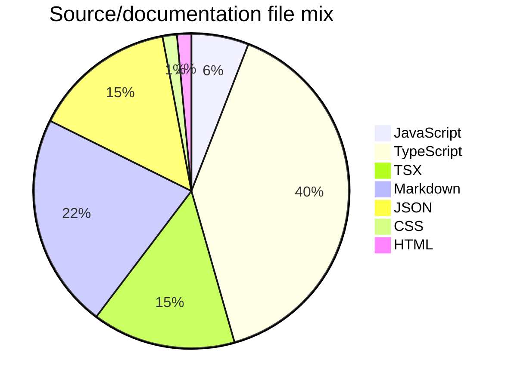

# Project Snapshot

Generated from the repository tree for public README/maintenance polish. Counts exclude `.git`, dependency folders, and build outputs.

## File Mix

- TypeScript: 27 files (40%)
- Markdown: 15 files (22%)
- TSX: 10 files (15%)
- JSON: 10 files (15%)
- JavaScript: 4 files (6%)
- CSS: 1 files (1%)
- HTML: 1 files (1%)

## Maintenance Checklist

- README describes purpose, setup, and limitations.
- CI runs baseline install/test/build checks where applicable.
- SECURITY.md explains vulnerability and secret handling.
- CHANGELOG.md tracks public changes.
- Issue and PR templates are available.

## Real Test Snapshot

- `npm test -- --runInBand` completed successfully on 2026-06-08.
- Current checks exercise logic, agent context export, MiniMax adapter behavior, and recorder behavior via scripts in `src/tests/`.
- A sample Playwright project is included under `test-project/` for dashboard/evidence workflows.
